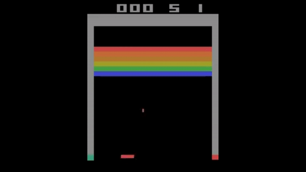

# deep-learning-atari
Atari game - deep Q learning neural network (Keras based)

The model used here is mostly following the paper by DeepMind:
[Playing Atari with Deep Reinforcement Learning](https://www.cs.toronto.edu/~vmnih/docs/dqn.pdf)

*Demo gif after training.*

## Parmeter
max_iter = 10,000,000  
steps between evaluation = 100,000  
learning rate = 0.00025  
steps between target network copying = 10,000  
experience replay memory size = 100,000  
gamma = 0.99 (discount factor)  
optimizer = RMSProp  

## Reward progress

